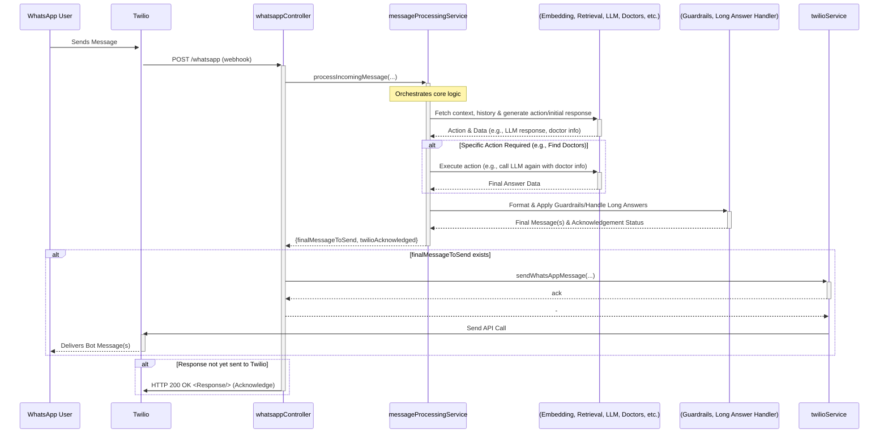

# Endobot


Endobot is an open-source AI-based WhatsApp chatbot specializing in endometriosis, chronic pain, and women's health. It is designed to provide information, support, and guidance to individuals navigating these conditions.

## 📌 About the Project

Endobot is being developed as part of the **Endopolítica** initiative ([Instagram](https://instagram.com/endopolitica)), which my wife and I co-founded. Our mission is to empower and support women at all stages of their journey with endometriosis—whether they are in the early investigation phase, undergoing treatment, or recovering from surgery.

This project is supported by the **StartBSB** program at **Fundação de Apoio à Pesquisa do Distrito Federal (FAP/DF)**, a government-led research funding agency.

## 🚀 Features

- **AI-Powered Assistance**: Uses Retrieval-Augmented Generation (RAG) capabilities to provide domain-specific scientific information on endometriosis and women's health.
- **Agentic behavior**: Endobot can query a curated relational database of trusted healthcare professionals we recommend to our community.
- **WhatsApp Integration**: Built to run on WhatsApp for easy accessibility to women everywhere.
- **Context-Aware Conversations**: Maintains conversation history for personalized support.

## 🔄 Project Status & Roadmap

This project is still in an **active early development stage**. While we've completed a lot of the planned features, we're waiting on cellphone carriers to greenlight us so we can go live.

### Roadmap

1. **Set up better project structure (Typescript, Unit testing, Linting, Monitoring, CI/CD with GitHub Actions and so on) 🔶**
2. **Provide a demo link 🔶**

## 🏗️ Tech Stack

- **Backend**: Node.js (Express.js)
- **Relational and Vector Store**: PostgreSQL + PgVector (Supabase)
- **Embedding and inference model hosting**: Whoever provides us with the best value (At the moment, we integrate with Together AI).
- **Messaging API**: Twilio (WhatsApp integration)
- **Deployment**: Docker on VPS servers.

## 📐 Architecture Overview

**Key Architectural Decisions:**

*   **Separation of Concerns:** The primary logic for handling messages is extracted into a dedicated `messageProcessingService`, keeping the `whatsappController` lean and focused on HTTP request/response handling and basic orchestration.
*   **Modular Services:** Functionality is broken down into distinct, single-responsibility services (e.g., `embeddingService`, `retrievalService`, `inferenceService`, `conversationService`, `doctorRecommendationService`) to promote reusability and maintainability.
*   **Retrieval-Augmented Generation (RAG):** The core answering mechanism involves retrieving relevant context from a vector store (`retrievalService`) based on the user message embedding (`embeddingService`) before generating a response (`inferenceService`).
*   **Agentic Capabilities:** The system uses the LLM (`inferenceService`) not just for answering but also to determine and execute specific actions (like `findDoctorsByCity`), interacting with other services (`doctorRecommendationService`) and potentially re-prompting the LLM with new observations.
*   **Stateful Conversations:** User conversation history is stored (`conversationService`) and provided back to the LLM to maintain context across multiple interactions.
*   **Modular External API Integration:** Endobot isolates interactions with external services (like messaging APIs and AI models) into dedicated modules. This abstraction makes it easier to adapt or switch providers (e.g., Twilio, Together AI) to optimize for cost or features, providing crucial flexibility for the project.

The following diagram illustrates the high-level flow of an incoming WhatsApp message:



## 📖 Getting Started

### Prerequisites

Ensure you have the following installed:
- [Node.js](https://nodejs.org/)
- [Supabase](https://supabase.com/)
- [Twilio](https://www.twilio.com/)
- [Docker](https://www.docker.com/)

### Installation

1. Clone the repository:
   ```sh
   git clone https://github.com/teogenesmoura/endobot.git
   cd endobot
   ```
2. Set up environment variables (`.env` file):
   ```sh
   NODE_ENV=production
   TWILIO_ACCOUNT_SID=your_twilio_account_sid
   TWILIO_AUTH_TOKEN=your_twilio_auth_token
   TWILIO_WHATSAPP_NUMBER=your_whatsapp_number
   TOGETHER_AI_API_KEY=your_api_key
   SUPABASE_URL=your_url
   SUPABASE_API_KEY=your_api_key
   ```
4. Build and start the container:
   ```sh
   docker compose build && docker compose up -d 
   ```

## 📜 Change Log

- **v0.1 (Initial Development):**
  - Read content from a text file, generate an embedding representation, and persist it to Supabase.
  - Receive WhatsApp messages via Twilio webhook.
  - Transform user messages to embeddings.
  - Fetch relevant documents from the vector store based on user message embedding.
  - Return augmented answers to users.
  - Implement agentic behavior to recommend Endometriosis doctors by city.

## 📜 License

This project is licensed under the MIT License - see the [LICENSE](LICENSE) file for details.

## 🙌 Acknowledgments

- **Endopolítica Community** – for their insights and continuous support.
- **FAP/DF & StartBSB** – for funding and supporting the project.

💙 _Together, we can provide better support for those navigating endometriosis and chronic pain!_

## ❓ FAQ

### 1. Why not just use the OpenAI models and library?

Flexibility. By not tying ourselves exclusively to OpenAI, we retain the ability to explore a variety of models, including those that are more cost-effective or better suited for specialized tasks. Additionally, avoiding strict dependency on OpenAI at this stage allows us to maintain greater control over data privacy, performance tuning, and deployment strategies.

### 2. Can I contribute?

We'll release a contribution guide soon!
